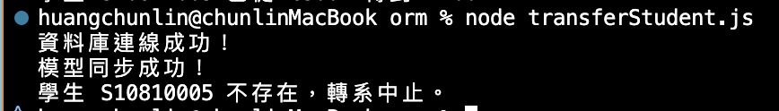

# orm 實作
## queryExample 多表查詢
**查詢所有尚未登記成績 (Grade IS NULL) 的學生與課程**
* 成功：

## transferStudent 學生轉系
**實作學生轉系流程，包含更新學生所屬系所以及相關選課狀態**
* 轉系成功：

> 可以到資料庫查看有沒有成功

* 轉系失敗：

## ormRelationTest 關聯查詢
**展示如何使用 Sequelize 處理一對多和多對多關係，並進行關聯查詢。**
* 成功：

* 失敗：
